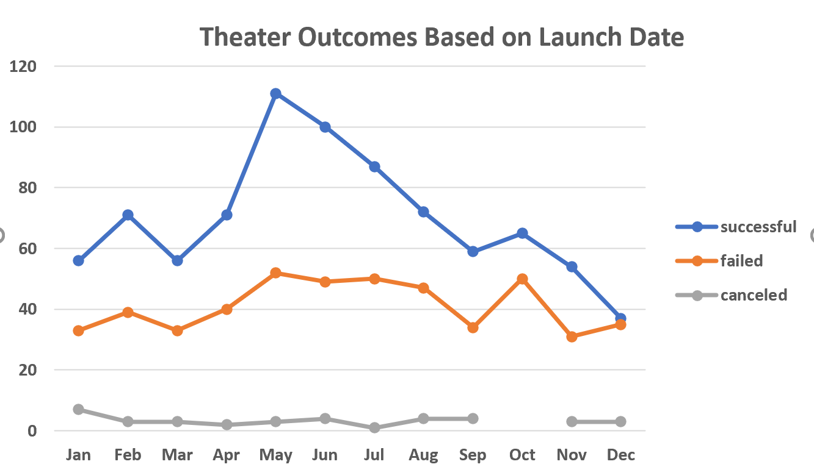

# Kickstarter-Campaign analysis
## Overview of the Project
### The purpose of this analysis is to help Louise to short amount of time to find out how the different campaign fared in related to the Theater Outcome by Launch Dates and the Outcomes based on Funding Goals. 
## Analysis and Challenges
### Analysis of Outcomes Based on Launch Dates
We use the Kickstarter dataset to create a pivot table based on Theater category and graphing line chart to visualize campaign outcomes: successful, failed and canceled. The result shows that we have a greater number of successful on the Theater Outcomes from May to July. Especially on May, which is launched the most successful on Louise’s Kickstarter Campaigns. 

Compared to the successful Theater Campaigns, we can also see the number of failed campaigns is roughly 40 throughout the year. However, December had almost the same number of successful and failed campaigns launched.
### Analysis of Outcomes Based on Goals
We use the percentage of successful, failed and cancel plays based on Funding Goal Amount to analyze our data. Using COUNTIFS function to help us optimize our findings. 
![Outcomes_vs_Goals] 
The resulting table shows that the percentage of outcomes based on different Funding Goal ranges. Where there is the Funding Goal is less than $4,999 has the highest successful rate. Also, there is 67% successful rate on the funding goal range of $35,000 to 44,999. As the Funding Goal sets higher, the outcome of failed is significant gets higher, for instance, 100% failed while the Funding Goal is between $45,000 to $49,999. This may mean that Louise should limit the higher funding goal on his campaigns. 
### Challenges and Dificulties Encountered
When we filter the Kickstarter dataset based on YEARS, which is challenging. Because we need to apply to another function to extract unreadable data. Also, there is an error when I apply to Excel COUNTIF functions to sort the data for outcomes based on Goal’s range. It shows too many arguments in this function. Lately, I figure out the difference between COUNTIF and COUNTIFS function.
## Results
Louise should focus on Kickstarter Campaign during the summertime. According to our data, the most popular month for Theater Campaign launched in May to August. From May to September, the number of successfully Theater Campaigns start to drop down significantly. Louise should improve her plays based on the outcomes. We can conclude that as the Funding Goal increases, the successful rate decreases significantly; however, while the funding goal sets to the range of $35,000 to $44,999, the outcomes of successful tends to go up again until it hits the higher bracket to reach 100% failed. Louise can use these insights to make a better Funding Goal decisions for her campaigns. Campaign based on the Year (2009 to 2017) is very broad, the dataset is very limited if we analyze based on the year. Not enough data to analyze on each category based on the launch date. We could create Bar chart, Pie chart, and Histogram to better visualize our data in order helps Louise to predict future trends for her campaigns.
